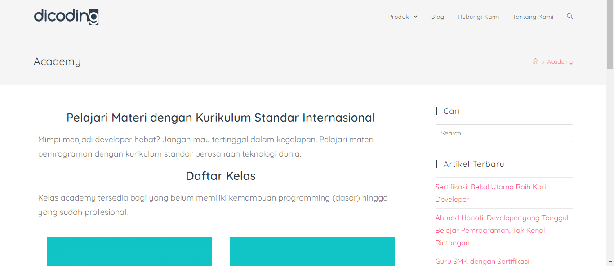
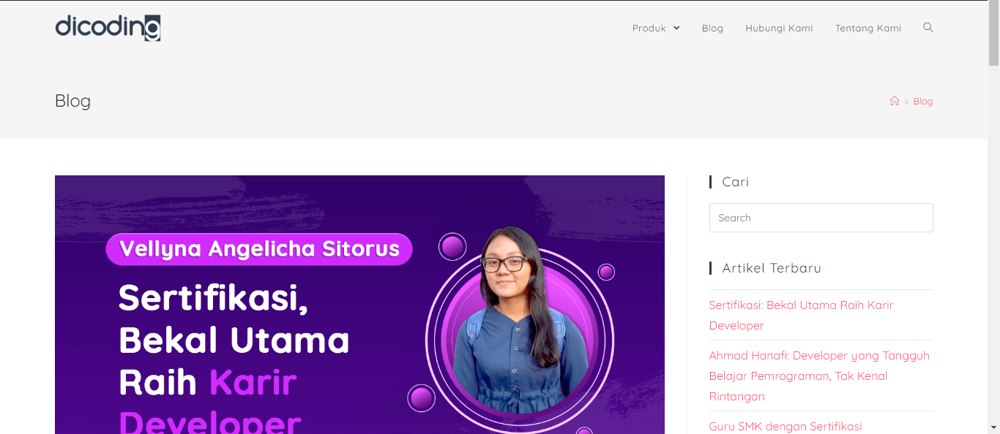

# Dicoding with WordPress
A wordpress website that about company profile of online programming course startup, Dicoding with different design and content. This project was builded for the Software House task.

## Documentation

For more documentation, you can view in this [link](https://youtu.be/g9bKk_vqs6M)

## Guide
### First Installation
For the first installation, you must follow the following commands before run the project :
- Clone from remote repo with command `git clone https://github.com/MuhammadArifFaizin/Dicoding_Wordpress/`

### Git Initialization
If you didn't set the git before, you can follow commands below :
- Init the git with `git init`
- Set your user config for commit activity
    * Set username with `git config --global user.name "YOUR_USERNAME"`
    * Set user email with `git config --global user.email "YOUR_EMAIL"`
- Add the remote property with command `git remote add REMOTE_NAME https://github.com/MuhammadArifFaizin/Dicoding_Wordpress.git`

### Running the Project
You can run this project by running the XAMPP in the `PROJECT_DIRECTORY/public`.
Then, make sure the Apache and MySQL has already started, and open the localhost in browser.

### Commit Changes
To make contribution to this project, make sure that you have added for contributor by the author.
After that, you can use following command to merging your current changes into the remote :
- Check your changes with `git status` to know anything that changed
- Add your changes to staged by `git add --all` for all changes
- Commit the staged file with some change message with `git commit -m "rX.XX - CHANGED_MESSAGE"`. Note that `rX.XX` is the revision version of the changes depend on latest changes, for examples : `r0.03`, `r1.35`, `r4.99`
- To sync your changes with the remote, you must do this :
    * Always make sure that you're updated with the remote by using `git status`, if there are have any differences, you can merge the differences to your local first with `git pull REMOTE_NAME master` to make sure there are no conflict with the latest updates
    * If your local have the latest updates, you can start to push the local commit into the remote by `git push REMOTE_NAME master`
Note :
If you doing any mistakes with previous commit, you can still change it with `git commit --amend -m "CHANGED_MESSAGE"` for revision with different messages or `git commit --amend --no-edit` for revision with same message

## Build by
- Wordpress v5.4.2
- Elementor v2.9.14
- OceanWP Theme v1.8.6
